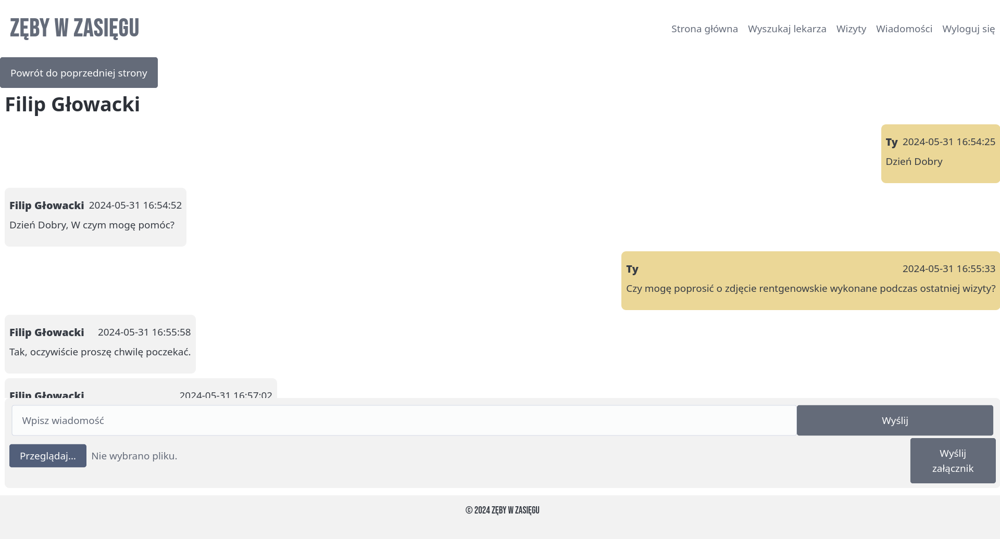

# Zęby W Zasięgu — Praca Inżynierska
### [EN] Introduction
The completed project is a web application that implements a chat using asymmetric encryption to ensure secure communication between a dentist and a patient. In addition to the chat, a visit management system has been implemented as part of the application development.

### Wprowadzenie
Ukończonym projektem jest aplikacja internetowa, która implementuje czat wykorzystujący szyfrowanie asymetryczne w celu zapewnienia bezpiecznej komunikacji pomiędzy lekarzem stomatologiem a pacjentem. W ramach rozwoju aplikacji zaimplementowano również system zarządzania wizytami.


### Struktura projektu

Do stworzenia aplikacji wykorzystaliśmy framework [Laravel](https://laravel.com/), który znacząco przyspieszył proces tworzenia aplikacji.


  
*Diagram poglądowy na strukturę aplikacji przy wykorzystaniu technologii Laravel. (źródło: opracowanie własne)*

### Operacje kryptograficzne

  
*Diagram poglądowy na część aplikacji odpowiedzialnej za kryptografię. (źródło: opracowanie własne)*

W ramach operacji kryptograficznych wykorzystaliśmy bibliotekę [OpenSSL](https://www.openssl.org/). Kompilator [Emscripten](https://emscripten.org/) umożliwił nam skompilowanie kodu C++ do formatu [WebAssembly](https://webassembly.org/), który może zostać uruchomiony w przeglądarce internetowej.

Wiadomości i pliki są szyfrowane w przeglądarce internetowej po stronie użytkownika, klucz prywatny wykorzystywany do szyfrowania jest przechowywany w pamięci przeglądarki użytkownika.

Użytkownik podczas pierwszego logowania generuje parę kluczy RSA. Klucz publiczny jest przesyłany do serwera, a z klucza prywatnego generujemy kod QR, który użytkownik zapisuje na swoim urządzeniu. Każdorazowo użytkownik, logując się do aplikacji musi wczytać kod QR zawierający klucz prywatny.

W ramach szyfrowania plików i wiadomości tekstowych wykorzystujemy algorytm AES w trybie CTR z kluczem o długości 256 bitów, którego klucz jest generowany losowo dla każdej wiadomości, a następnie jest on szyfrowany z użyciem kluczy publicznych RSA odbiorcy i nadawcy.
  

  
*Przedstawienie zdjęcia przed i po procesie szyfrowania. (źródło: opracowanie własne, fotografia autorstwa [Diana Polekhina](https://unsplash.com/photos/person-holding-pink-plastic-hair-clip-4nUZl0FZM3U)*
#### Szyfrowanie wiadomości
```
Argumentami wejściowymi dla funkcji szyfrującej są:
- klucz publiczny odbiorcy
- klucz publiczny nadawcy
- wiadomość do zaszyfrowania

Argumentami wyjściowymi są:
- zaszyfrowana wiadomość
- zaszyfrowany klucz AES
- wektor inicjalizacyjny
- informacja o ilości i długości kluczy wykorzystanych do szyfrowania
```
#### Deszyfrowanie wiadomości
```
Argumentami wejściowymi dla funkcji deszyfrującej są:
- klucz prywatny odbiorcy lub nadawcy
- zaszyfrowana wiadomość
- zaszyfrowany klucz AES
- wektor inicjalizacyjny
- informacja o ilości i długości kluczy wykorzystanych do szyfrowania

Argumentami wyjściowymi są:
- odszyfrowana wiadomość
```
### Wybrane widoki aplikacji

#### Ekran czatu

  
*Widok przedstawiający rozmowę pomiędzy lekarzem a pacjentem. (źródło: opracowanie własne)*
#### Ekran wyszukiwania gabinetów stomatologicznych

  
*Widok przedstawiający wyszukiwarkę gabinetów ze wpisaną lokalizacją. (źródło: opracowanie własne, autorzy wykorzystanych fotografii z kolejnością od góry: [Filip Rankovic Grobgaard](https://unsplash.com/photos/a-man-smiling-for-the-camera-9_1Y_IKP4tY), [Usman Yousaf](https://unsplash.com/photos/man-in-white-dress-shirt-wearing-black-framed-eyeglasses-pTrhfmj2jDA), [Humberto Chávez](https://unsplash.com/photos/woman-standing-under-tree-FVh_yqLR9eA), [Austin Distel](https://unsplash.com/photos/man-in-white-suit-jacket-7bMdiIqz_J4), [Jonathan Borba](https://unsplash.com/photos/man-in-white-dress-shirt-wearing-black-framed-eyeglasses-Yui-VjmS8AA),[Jeremy Alford](https://unsplash.com/photos/a-woman-in-a-white-coat-O13B7suRG4A))*
#### Ekran przedstawiający profil gabinetu stomatologicznego

  
*Widok przedstawiający ofertę gabinetu lekarza. (źródło: opracowanie własne, wykorzystana fotografia autorstwa [Filip Rankovic Grobgaard](https://unsplash.com/photos/a-man-smiling-for-the-camera-9_1Y_IKP4tY))*